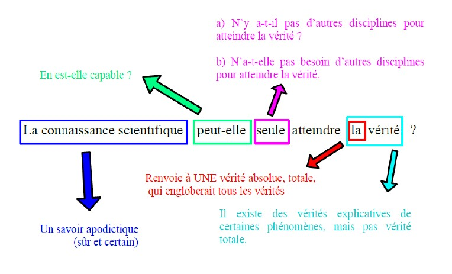
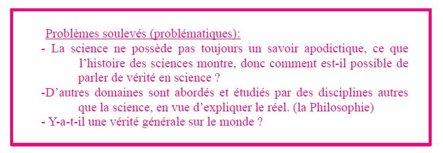

  <head>
 <meta charset="utf-8" />
 <link href="style.css" rel="stylesheet" type="text/css" />
 <link rel="stylesheet" href="print.css" type="text/css" media="print" />
 </head>
 <body>
 
Exemple de Dissertation

 

Avant de commencer:

 
Ici, on vous propose une analyse du sujet ainsi qu'un plan détaillé. On vous propose également une PROPOSITION d'introduction  et une PROPOSITION de conclusion.

 
Notez bien qu'il n'existe pas un plan <b> TYPE</b>, ou une introduction <b> TYPE</b> ou encore une conlusion <b> TYPE</b>. Id est, dans la mesure où vos propos est cohérant avec le sujet et que vous argumentez vos propos avec des références philosophiques pertinantes, tout rédaction sera valide.
  
  
 

 
 Pour que vous ayez un exemple d'analyse et de rédaction, nous allons analyser un sujet sur la notion de <i>"Vérité"</i>

 

  
  
 
  
  
 
 

  

 
[Plan détaillé (environ 30 min)]

 
I- Thèse : La science explique à l’aide de théories, les phénomènes observés, elle semble être le plus sûr moyen d’y parvenir.

  
&nbsp;&nbsp; &nbsp;&nbsp; &nbsp;&nbsp;Elle fait de rigueur dans sa méthode (protocole), en vue d’établir des vérités sur le réel.
   &nbsp;&nbsp; &nbsp;&nbsp; &nbsp;&nbsp;&nbsp;&nbsp; &nbsp;&nbsp; &nbsp;&nbsp;  Référence : René DESCARTES → les vérités mathématiques
   &nbsp;&nbsp; &nbsp;&nbsp; &nbsp;&nbsp;&nbsp;&nbsp; &nbsp;&nbsp; &nbsp;&nbsp;Exemple : E= mc2 / Théorème de Pythagore / Théorème de Thalès
   &nbsp;&nbsp; &nbsp;&nbsp; &nbsp;&nbsp;Elle utilise la logique dans ses démonstrations afin d’éviter l’erreur, elle s’appuie sur des preuves.
   &nbsp;&nbsp; &nbsp;&nbsp; &nbsp;&nbsp;&nbsp;&nbsp; &nbsp;&nbsp; &nbsp;&nbsp;Référence : Emmanuel KANT → la vérité formelle (p.524)
   &nbsp;&nbsp; &nbsp;&nbsp; &nbsp;&nbsp;&nbsp;&nbsp; &nbsp;&nbsp; &nbsp;&nbsp;Exemple : Syllogisme d’ARISTOTE
    &nbsp;&nbsp; &nbsp;&nbsp; &nbsp;&nbsp;Ce que l’on observe, c’est que la science utilise d’autres domaines comme les mathématiques, la logique pour éviter de se tromper, donc en vue d’approcher une vérité démonstrative cohérente. C’est pourquoi la physique contemporaine utilise les mathématiques comme outil.
   &nbsp;&nbsp; &nbsp;&nbsp; &nbsp;&nbsp;&nbsp;&nbsp; &nbsp;&nbsp; &nbsp;&nbsp;Exemple : la cinétique utilise la mécanique / en électricité utilisation de sinusoïde / Produit scalaire (outil math inventé pour les physiques) 
   <b>&nbsp;&nbsp; &nbsp;&nbsp; &nbsp;&nbsp;Cependant, on observe dans l’histoire des sciences que la connaissance scientifique a progressé en se trompant, ce qui questionne la notion de vérité.</b>

   
 
II-Antithèse : montre les limites de la thèse : La science possède également un savoir zététique, qui la définit principalement dans la mesure à ses connaissances peuvent être remises en question.

 
&nbsp;&nbsp; &nbsp;&nbsp; &nbsp;&nbsp;La connaissance scientifique évolue grâce aux erreurs qu’elle commet.
   &nbsp;&nbsp; &nbsp;&nbsp; &nbsp;&nbsp;&nbsp;&nbsp; &nbsp;&nbsp; &nbsp;&nbsp;Référence :Thomas KUHN → Le changement de paradigme
   &nbsp;&nbsp; &nbsp;&nbsp; &nbsp;&nbsp;&nbsp;&nbsp; &nbsp;&nbsp; &nbsp;&nbsp;Exemple : KEPLER → NEWTON → EINSTEIN 
    &nbsp;&nbsp; &nbsp;&nbsp; &nbsp;&nbsp;De surcroît, la scène n’est pas le seule à chercher, à comprendre et à expliquer le réel. La philosophie également poursuit cette loi.
   &nbsp;&nbsp; &nbsp;&nbsp; &nbsp;&nbsp;&nbsp;&nbsp; &nbsp;&nbsp; &nbsp;&nbsp;Référence : Allégorie de Caverne 
   &nbsp;&nbsp; &nbsp;&nbsp; &nbsp;&nbsp;&nbsp;&nbsp; &nbsp;&nbsp; &nbsp;&nbsp;Exemple : Maïeutique de Socrate
  &nbsp;&nbsp; &nbsp;&nbsp; &nbsp;&nbsp;La connaissance scientifique implique la réfutabilité / falsifiabilité de ses théories.
   &nbsp;&nbsp; &nbsp;&nbsp; &nbsp;&nbsp;&nbsp;&nbsp; &nbsp;&nbsp; &nbsp;&nbsp;Référence : Karl POPPER 
   &nbsp;&nbsp; &nbsp;&nbsp; &nbsp;&nbsp;&nbsp;&nbsp; &nbsp;&nbsp; &nbsp;&nbsp;Exemple : Remise en question des théorèmes régulièrement ou contre-exemple : Ne sont pas scientifiques la théorie freudienne de l’inconscient et la théorie de la lutte des classes (dominant / dominé) de Karl MARX 
   <b>&nbsp;&nbsp; &nbsp;&nbsp; &nbsp;&nbsp;Néanmoins, la connaissance scientifique, si elle apporte des éléments de compréhension sur le réel, on ne peut pas parler de vérité totale sur ce dernier.</b>

    
 
III- Comment la connaissance scientifique peut établir des vérités sur la réalité et est-ce possible ? 

 
&nbsp;&nbsp; &nbsp;&nbsp; &nbsp;&nbsp;La notion de vérité sous-entend qu’il existerait une vérité générale qui comprendrait la totalité des phénomènes. Or on observe qu’une théorie englobante semble impossible, car plus nos connaissance progressent, plus on prend conscience de ce que l’on ignore.
   &nbsp;&nbsp; &nbsp;&nbsp; &nbsp;&nbsp;&nbsp;&nbsp; &nbsp;&nbsp; &nbsp;&nbsp;Référence : EINSTEIN et INFELD → la vérité est idéalisée par le chercheur
   &nbsp;&nbsp; &nbsp;&nbsp; &nbsp;&nbsp;&nbsp;&nbsp; &nbsp;&nbsp; &nbsp;&nbsp;Exemple : en Neurologie, les connaissances sur le cerveau sont limitées.

  &nbsp;&nbsp; &nbsp;&nbsp; &nbsp;&nbsp;C’est parce que la science possède et avance en élaborant plutôt des conjectures / des hypothèses pour expliquer les phénomènes, puisqu’aucune vérité scientifique n’est jamais définitivement acquise .
   &nbsp;&nbsp; &nbsp;&nbsp; &nbsp;&nbsp;&nbsp;&nbsp; &nbsp;&nbsp; &nbsp;&nbsp;Référence : EINSTEIN et INFELD
   &nbsp;&nbsp; &nbsp;&nbsp; &nbsp;&nbsp;&nbsp;&nbsp; &nbsp;&nbsp; &nbsp;&nbsp;Exemple : La théorie de la relativité de NEWTON a été réfutée par EINSTEIN.

  &nbsp;&nbsp; &nbsp;&nbsp; &nbsp;&nbsp; La science n’est pas un dogme, c’est-à-dire sur laquelle il est interdit de s’interroger.
   &nbsp;&nbsp; &nbsp;&nbsp; &nbsp;&nbsp;&nbsp;&nbsp; &nbsp;&nbsp; &nbsp;&nbsp;Exemple :Contrairement à la religion qui s’impose comme indubitable dans la mesure où elle est une vérité révélée.

 

  
Ici, on vous propose une PROPOSITION d'introduction ainsi que d'une conclusion. 

 
[introduction]

  
&nbsp;&nbsp; &nbsp;&nbsp; &nbsp;&nbsp;L’histoire des sciences montre que des connaissances démontrées, prouvées à un moment se révèlent fausses à un autre, du fait des progrès scientifiques. Ces faits posent la question la vérité, c’est-à-dire l’adéquation / la concordance de ce qui est dit sur le phénomène avec le phénomène lui-même, en science.
   &nbsp;&nbsp; &nbsp;&nbsp; &nbsp;&nbsp;Ainsi, peut-on définir la connaissance scientifique, comme l’ensemble des savoirs démontrés selon une méthode rigoureuse acquise par la science en général. La capacité  [peut]  à expliquer le réel s’appuie donc sur des outils [seul]  , tels les  mathématiques et la logique. Nous constatons également que d’autres disciplines s’appliquent à comprendre la réalité.
   &nbsp;&nbsp; &nbsp;&nbsp; &nbsp;&nbsp;C’est pourquoi nous pouvons nous interroger sur la pertinence de parler de « vérité » en science, dans la mesure où elle progresse en se trompant. De surcroît est-il possible d’envisager une vérité unique et globalisante. La science est-elle la seule discipline à rechercher la vérité ? N’a-t-elle pas également besoin d’autres disciplines pour étudier ?
   &nbsp;&nbsp; &nbsp;&nbsp; &nbsp;&nbsp;Dans un premier temps, nous montrerons que la connaissance scientifique apporte des explications sûres et certaines sur les phénomènes, grâce à sa méthode rigoureuse. Cependant, dans un deuxième temps, nous démontrerons que la connaissance scientifique se définit par sa réfutabilité, elle propose donc des vérités temporaires. Pour cette raison, nous soulignerons que la science n’étant pas un dogme, le travail du chercheur est de se fixer un horizon, celui d’une vérité idéale.
  
  
 
 
  
[Conclusion]

  
&nbsp;&nbsp; &nbsp;&nbsp; &nbsp;&nbsp;Nous avons pu mettre en évidence que la méthode scientifique permet de distinguer les vérités démontrées acquises par la science des opinions ou des croyances. D’autre part, nous avons souligné que les vérités scientifiques ne sont pas définitives, elles se définissent par leur réfutabilité, comme le chercheur invente des théories explicatives, la philosophe (ou historien, l’économiste, le sociologue, etc.) à comprendre le réel. Ainsi, la science n’est-elle pas seule à tenter de saisir la réalité. Enfin, nous avons développé l’idée que la connaissance scientifique apporte des vérités temporaires qui visent un horizon de connaissance qu’EINSTEIN et INFELD nomment une « vérité idéale ».
  

 
   
 

 <form>
  <input id="impression" name="impression" type="button" onclick="imprimer_page()" value="Imprimer cette page" />
 </form>
 <h1 id="para11">
<a href="https://23tr-an05.github.io/Md/">Dissertation sur question méthode</a>
</h1>
 
 
 
 

